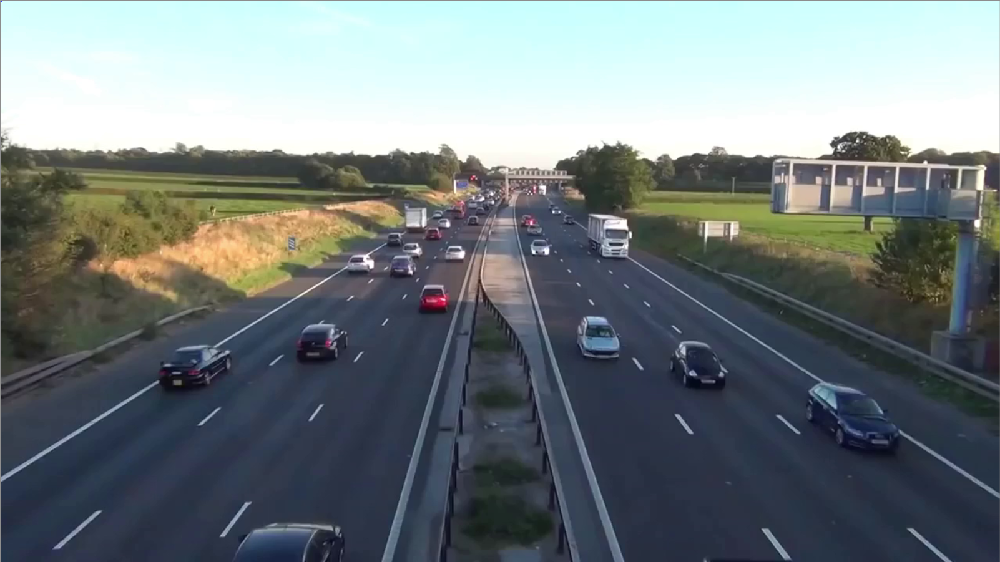
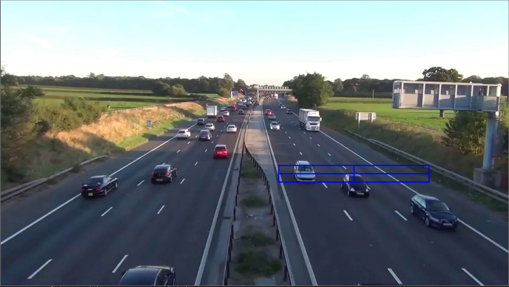

# Control-Number-of-People-and-Transport-Vehicles
This is an implementation of [Yolo-V3](https://arxiv.org/pdf/1804.02767.pdf) and [Deep-SORT](https://arxiv.org/pdf/1703.07402.pdf) on Python 3, Keras, and TensorFlow

### Prerequisite
Hardware
- Linux

Software
- Python 3.6

Yolo-v3 Weight
- Download YOLOv3-320(https://pjreddie.com/darknet/yolo/) and Save in /yolo_module/weight

### Install requirements
```
pip install virtualenv
python3 -m virtualenv venv
venv/bin/activate
# using cpu
pip install -r requirements-cpu.txt
# or using gpu
pip install -r requirements-gpu.txt
```

### Run
```
python main.py <video_link> <object-classes>
eg: python main.py video/Road-traffic-video.mp4 car
eg: python main.py video/Road-traffic-video.mp4 person
eg: python main.py video/Road-traffic-video.mp4 car,motobike
```
Init:


Select ROI:


Result:
